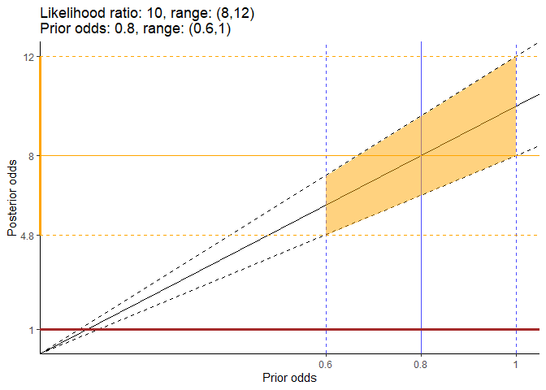

<!-- README.md is generated from README.Rmd. Please edit that file -->

# likRatioPlot

<!-- badges: start -->

<!-- badges: end -->

The package likRatioPlot provides a function to generate a plot that
shows the relationshp between the prior odds, likelihood ratio and
posterior odds, with a particular emphasis on the role uncertainty in
the prior odds and likelihood ratio plays on uncertainty in the
posterior odds.

## Installation

You can install the development version of likRatioPlot from
[GitHub](https://github.com/) with:

``` r
# install.packages("devtools")
devtools::install_github("jrodu/likRatioPlot")
```

## Example

Below is a likelihood ratio plot when the computed point estimate for
the likelihood ratio is 10, with an uncertainty interval between 8 and
12, and a prior odds point estimate of .8 with uncertainty interval from
.6 to 1.

``` r
library(likRatioPlot)

lik_ratio_plot(10, c(8, 12), .8, c(.6, 1))
```


